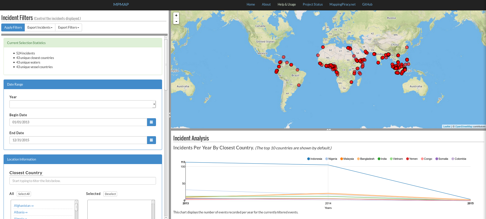
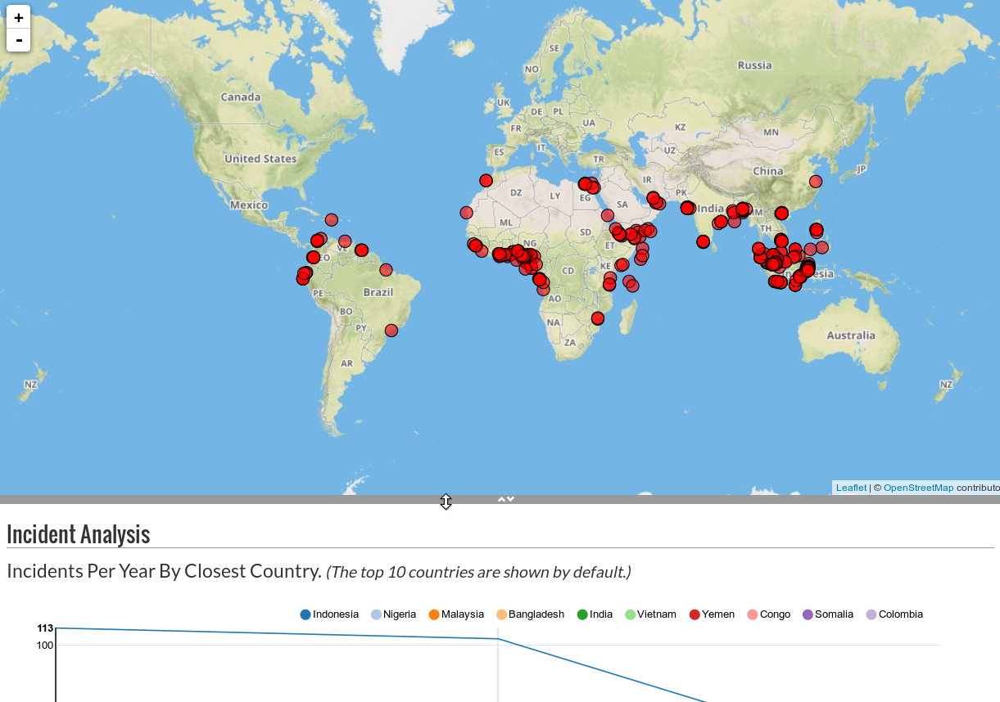
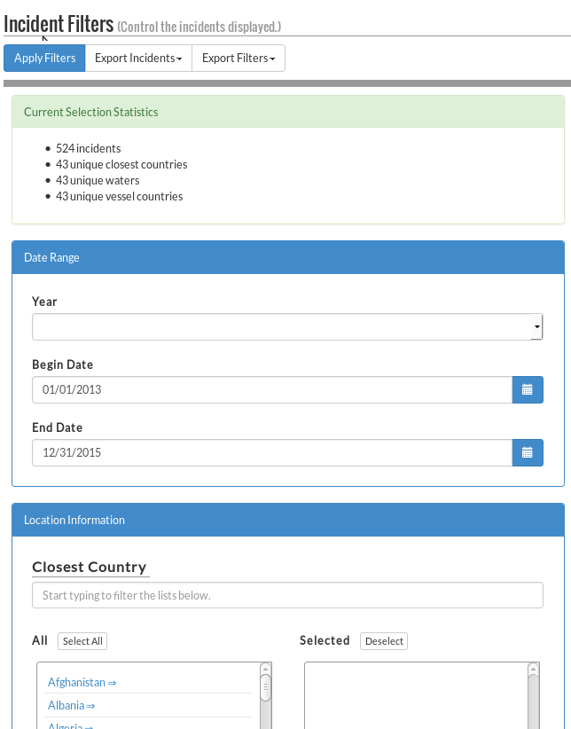
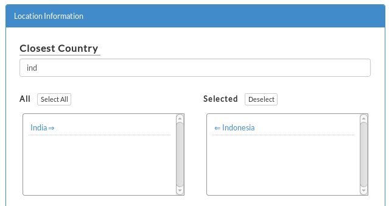
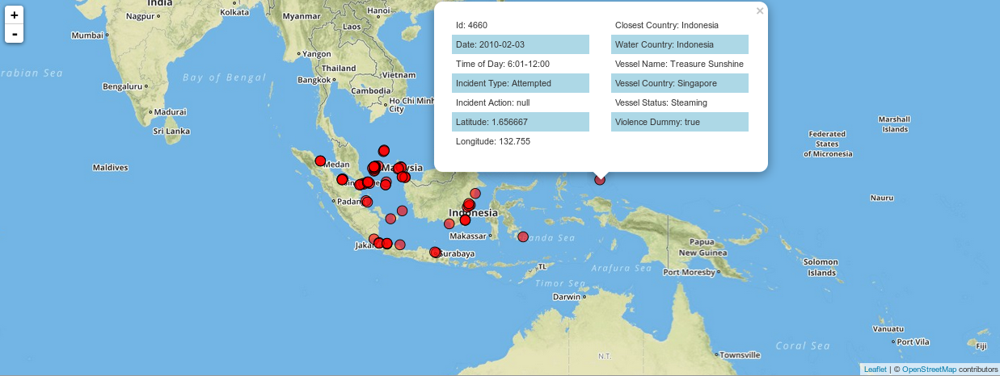
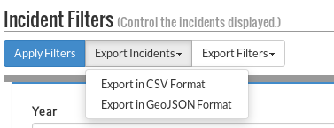
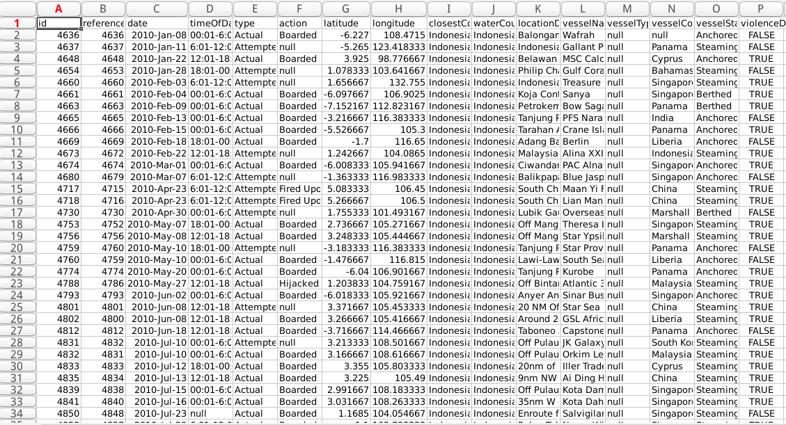
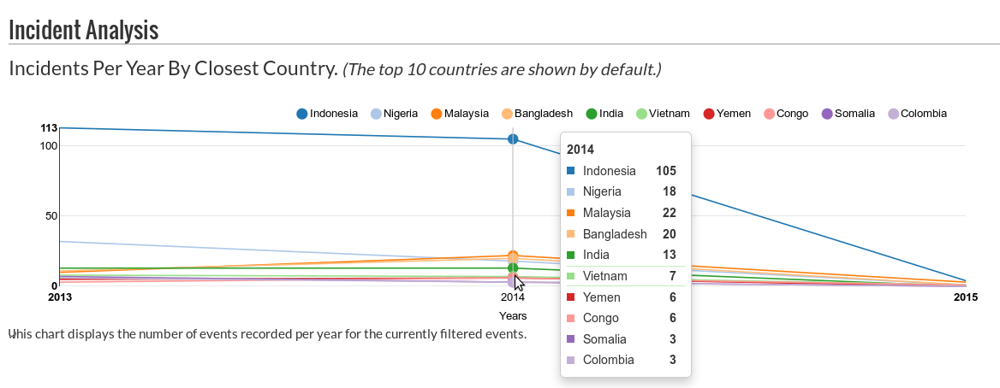

#MPMAP Usage

##Contents

####[1. Functionality](#functionality)  
####[2. General Usage](#general-usage)  
####[3. Usage Examples](#usage-examples)  

***
***

##1. Functionality

MPMAP provides the following functionality:

- Filter 6500+ maritime piracy incidents on date, location, vessel, and conflict parameters.
- Map the filtered incidents with informational popups.
- Export the filtered incidents in CSV or GeoJSON format and the applied filters in JSON format.
- Analyze the filtered incidents via a graph displaying incidents per year by closest country.

***
***

##2. General Usage

###a. Initial View

MPMAP is initialized with the last three calendar years of incident data, and analysis of the incident per year values for the top ten countries in this timespan.

###b. Layout

The MPMAP layout consists of three panes: Incident Filters, the map, and Incident Analysis. The gray bars separating these panes may be clicked and dragged to increase or decrease the size of each pane.

***
***

##3. Usage Examples

###a. Filter Incidents

To filter the incidents, use the Incident Filters pane on the left of the screen. Scroll down to view all of the possible filters. **Click *Apply Filters* to apply the filters you've selected.**

Location, vessel, and conflict filters are applied via a filtering mechanism that allows you to easily search and add multiple parameters. Simply start typing the name of your desired parameter, and click on it in the "All" field to use it as a search parameter.

###b. View the Filtered Incidents on the Map

Once filtered, the incidents are rendered on the map as red, semi-transparent circles. These can be clicked to reveal more information about the incident. The map can be dragged and zoomed to view the incidents in greater or lesser detail.

###c. Export the Filtered Incidents and Applied Filters

Once filtered, the incidents can be exported in **CSV or GeoJSON format**. The applied filters can be exported in **JSON format**. Click the *Export Incidents* or *Export Filters* buttons, and choose a format from the dropdown. Depending on your browser, the file will either be automatically downloaded, opened, or you will be prompted to save the file.

###d. Analyze the Filtered Incidents

If the **Closest Country filter** is not set, the incidents per year analysis graph is automatically rendered for the top ten countries in any given incident selection. Otherwise only the countries selected in the **Closest Country filter** are used for the analysis. 

The graph may be hovered at yearly intervals to show exact figures for each country in that year.

